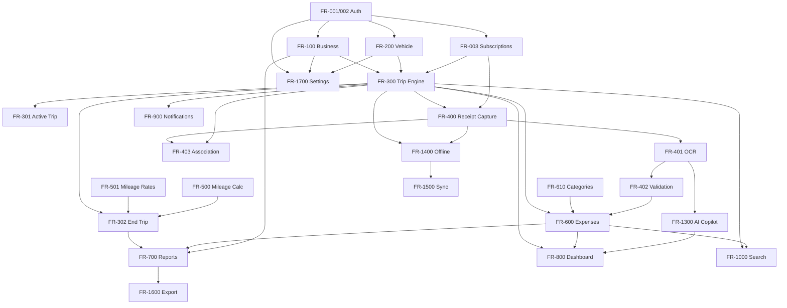

# Mileage & Expense Copilot

# Master Build Blueprint

# Volume 3 — Functional Requirements & Business Logic Specification

**Version 1.0**

---

## Who This Document Is For

Volume 3 is the **behavioral contract** for Mileage & Expense Copilot. If Volume 2 defines *how users experience* the product, Volume 3 defines *exactly how the product behaves*. Nothing is left to interpretation.

| Role | Use this document to… |
|------|----------------------|
| **Product** | Define scope, acceptance criteria, and feature gates |
| **Engineering** | Implement business logic, validation, and APIs |
| **QA** | Write test cases from acceptance criteria (Chapter 20) |
| **AI** | Bound OCR and suggestion behavior (Chapter 13) |
| **Support** | Understand expected behavior vs. bugs |

**Related:** [Volume 2 — Experience Architecture](02-user-experience.md) · [Volume 4 — Database Architecture](04-database-architecture.md) · [Volume 5 — AI & Intelligence Architecture](05-ai-design.md)

---

# Chapter 1 — Purpose & Requirement Template

Every feature in this volume follows the **same structure**. No exceptions.

| Section | Definition |
|---------|------------|
| **Objective** | Why the feature exists |
| **Inputs** | All data accepted |
| **Outputs** | All data produced or state changes |
| **Business rules** | Logic that must always hold |
| **Validation rules** | Reject conditions before processing |
| **Error handling** | Expected failures, user message, recovery |
| **Dependencies** | Features or entities required first |
| **Permissions** | Who may invoke; plan/role gates |
| **Success conditions** | Observable proof the feature worked |
| **Future extensibility** | V1.1+ hooks without breaking V1 |

**FR ID convention:** `FR-NNN` — grouped by domain (001–099 user, 100–199 business, 200–299 vehicle, 300–399 trip, 400–499 receipt, 500–599 mileage, 600–699 expense, 700–799 report, 800–899 platform engines).

---

# Chapter 2 — User Management

## FR-001 User Registration

| Section | Specification |
|---------|---------------|
| **Objective** | Create a new account and default profile |
| **Inputs** | `full_name`, `email`, `password`, `terms_accepted` (boolean, must be true) |
| **Outputs** | `auth.users` record · `profiles` record · verification email queued · default `subscriptions.plan = free` |
| **Business rules** | Email verification required before full app access; onboarding flow begins after verify |
| **Validation** | Email unique (case-insensitive) · valid email format · password ≥ 8 chars · name 1–100 chars · terms must be true |
| **Error handling** | Duplicate email → "An account with this email already exists" · weak password → strength hint · network → retry |
| **Dependencies** | Supabase Auth · email provider |
| **Permissions** | Public (unauthenticated) |
| **Success conditions** | User row exists · verification email sent · redirect to `/auth/verify` |
| **Future extensibility** | OAuth signup (Google, Apple) merges into same profile creation path |

---

## FR-002 Authentication

| Section | Specification |
|---------|---------------|
| **Objective** | Secure sign-in, session lifecycle, and account recovery |
| **Inputs** | Email/password · reset token · refresh token · biometric unlock token (mobile, V1.1) |
| **Outputs** | JWT session (HTTP-only cookies via SSR) · session refresh · password reset confirmation |
| **Business rules** | Session TTL 1 hour; refresh rotation enabled · "Remember device" extends refresh window to 30 days · "Logout everywhere" invalidates all `auth.sessions` for user · biometric unlock reopens existing session only (no password storage) |
| **Validation** | Credentials match · email verified before full access · reset token not expired |
| **Error handling** | Invalid credentials → generic "Invalid email or password" (no user enumeration) · unverified → redirect verify · rate limit → "Too many attempts, try again in X minutes" |
| **Dependencies** | FR-001 · `@supabase/ssr` middleware |
| **Permissions** | Public: login, forgot password · Authenticated: logout, logout-all, change password |
| **Success conditions** | Valid session cookie set · `auth.uid()` available · dashboard accessible |
| **Future extensibility** | MFA/TOTP (FR-002b stub route in Volume 2) · OAuth · passkeys |

---

## FR-003 Subscription Enforcement

| Section | Specification |
|---------|---------------|
| **Objective** | Dynamically gate features by plan tier |
| **Inputs** | `user_id` · action type (`start_trip`, `scan_receipt`, `export_csv`, etc.) |
| **Outputs** | `allowed: boolean` · `remaining_quota` · `upgrade_required: boolean` |
| **Business rules** | Plan resolution: `subscriptions` table → default `free` · limits enforced at **action time**, not read time · usage counters reset on calendar month boundary (user timezone) · Stripe webhook updates plan within 60s of payment |
| **Validation** | Valid authenticated user |
| **Error handling** | Limit exceeded → block action + upgrade modal (Volume 2) · Stripe past_due → grace 3 days then downgrade to free |
| **Dependencies** | FR-001 · Stripe webhooks · `usage_counters` table |
| **Permissions** | System evaluates on every gated action |
| **Success conditions** | Free user blocked on 6th trip · Pro user never blocked on trips · CSV export blocked for Free |
| **Future extensibility** | Business/Enterprise tiers · per-seat billing · feature flags table |

### Plan Feature Matrix (V1)

| Feature | Free | Pro | Business | Enterprise |
|---------|------|-----|----------|------------|
| Trips/month | 5 | ∞ | ∞ | ∞ |
| Receipts/month | 10 | ∞ | ∞ | ∞ |
| Vehicles | 1 | ∞ | ∞ | ∞ |
| Businesses | 1 | ∞ | ∞ | ∞ |
| PDF export | ✓ | ✓ | ✓ | ✓ |
| CSV/Excel export | ✗ | ✓ | ✓ | ✓ |
| Team employees | ✗ | ✗ | 5 | ∞ |
| Approval workflows | ✗ | ✗ | V1.1 | ✓ |

---

# Chapter 3 — Business Management

## FR-100 Business Profile

| Section | Specification |
|---------|---------------|
| **Objective** | Organize trips, expenses, and reports by business entity |
| **Inputs** | `name` * · `address` (jsonb, optional) · `tax_id` (optional, app-layer encrypt V1.1) · `logo` (storage URL, optional) · `default_mileage_rate` (optional) · `default_currency` (char(3), default USD) · `timezone` (IANA) · `is_active` (boolean, default true) · `is_default` (boolean) |
| **Outputs** | `businesses` record |
| **Business rules** | Free: max 1 business · Pro+: unlimited · exactly one `is_default = true` per user · soft delete sets `deleted_at`; trips retain historical `business_id` · inactive business hidden from selectors but visible in history |
| **Validation** | Name required, 1–100 chars · currency valid ISO 4217 · timezone valid IANA |
| **Error handling** | Limit exceeded → FR-003 upgrade · duplicate default resolved by unsetting prior default on save |
| **Dependencies** | FR-001 · FR-003 |
| **Permissions** | Owner only (V1) · Business admin (V1.1) |
| **Success conditions** | CRUD persists · default business loads on dashboard · audit log on update |
| **Future extensibility** | Multi-user business access · EIN encryption · logo on PDF reports |

---

# Chapter 4 — Vehicle Management

## FR-200 Vehicle

| Section | Specification |
|---------|---------------|
| **Objective** | Track mileage and expenses per vehicle |
| **Inputs** | `nickname` * · `make` · `model` · `year` · `license_plate` (optional) · `current_odometer` · `default_mileage_rate` (optional override) · `fuel_type` (enum: gas, diesel, electric, hybrid, other) · `is_active` · `is_default` · `business_id` (optional link) |
| **Outputs** | `vehicles` record |
| **Business rules** | Free: 1 vehicle · Pro+: unlimited · `current_odometer` updated automatically on trip complete (FR-302) · ending mileage on any trip ≥ starting mileage for that trip · one default vehicle per user · inactive vehicles excluded from Start Trip selector |
| **Validation** | Nickname required · year 1900–(current+1) · odometer ≥ 0 · monotonic warning if new odometer < last trip end (warn, don't block) |
| **Error handling** | Limit exceeded → upgrade · invalid year → inline error |
| **Dependencies** | FR-100 (optional) · FR-003 |
| **Permissions** | Owner |
| **Success conditions** | Vehicle appears in Start Trip selector · odometer updates after trip end |
| **Future extensibility** | Fleet IDs · MPG tracking · maintenance reminders |

---

# Chapter 5 — Trip Engine

The application's core. All trip FRs share entity `trips`.

## FR-300 Start Trip

| Section | Specification |
|---------|---------------|
| **Objective** | Begin documenting a business trip |
| **Inputs** | `business_id` * · `vehicle_id` * · `purpose` * · `client` · `destination` · `start_odometer` · `start_location` (text) · `start_lat`, `start_lng` · `notes` |
| **Outputs** | `trips` row: `status = active` · `started_at = now()` · GPS coords if permitted |
| **Business rules** | **V1:** one active trip per **user** (UX Volume 2) · **Schema supports** one active trip per **vehicle** for V1.1 fleet · autosave draft every 30s (local + server if online) · FR-003 trip quota checked before commit · default business/vehicle pre-filled |
| **Validation** | Purpose 1–500 chars · business and vehicle belong to user · vehicle active · start_odometer ≥ 0 if provided |
| **Error handling** | Active trip exists → modal: go to active or cancel · quota exceeded → upgrade · offline → queue locally (FR-1400) |
| **Dependencies** | FR-100 · FR-200 · FR-003 · FR-1400 |
| **Permissions** | Authenticated owner |
| **Success conditions** | Status active · timestamp recorded · dashboard banner appears · audit `create` logged |
| **Future extensibility** | Scheduled trips · multi-stop · calendar import |

### Acceptance Criteria (FR-300)

- [ ] Trip saves successfully online and offline
- [ ] Status = `active`
- [ ] `started_at` recorded in UTC
- [ ] Starting odometer validated if provided
- [ ] Active trip appears on dashboard within 2s
- [ ] Audit log entry created

---

## FR-301 Active Trip

| Section | Specification |
|---------|---------------|
| **Objective** | Hub for in-progress trip actions |
| **Inputs** | `trip_id` · user navigation |
| **Outputs** | Rendered state: elapsed time · estimated GPS miles (if coords streaming) · expense list · quick actions |
| **Business rules** | Elapsed = `now - started_at` · GPS estimate uses haversine between start and current (optional, non-authoritative until end) · quick actions: add receipt (FR-400), add note, end trip (FR-302) |
| **Validation** | Trip must be `active` and owned by user |
| **Error handling** | Trip not active → redirect to trip detail · not found → 404 |
| **Dependencies** | FR-300 · FR-400 · FR-600 |
| **Permissions** | Trip owner |
| **Success conditions** | All sections render · actions route correctly |
| **Future extensibility** | Live map · waypoint stops |

---

## FR-302 End Trip

| Section | Specification |
|---------|---------------|
| **Objective** | Close trip; compute mileage, reimbursement, and totals |
| **Inputs** | `trip_id` · `end_odometer` · `end_location` · `end_lat`, `end_lng` · `notes` · `checklist_responses` (jsonb) |
| **Outputs** | `status = completed` · `ended_at` · `miles` · `mileage_rate` (snapshot) · `reimbursement_amount` · `expense_total` · `grand_total` · vehicle `current_odometer` updated |
| **Business rules** | "Forgot Something?" checklist presented before final submit (Volume 2 Journey C) · reimbursement = `miles × mileage_rate` · rate snapshot at completion (FR-501) · `grand_total = reimbursement + expense_total` · trip cannot end before `started_at` |
| **Validation** | `end_odometer ≥ start_odometer` when both set · at least one mileage source: odometer pair OR GPS distance OR manual `miles` override · end timestamp ≥ start |
| **Error handling** | Invalid odometer → inline error with values shown · missing mileage → prompt manual miles entry |
| **Dependencies** | FR-300 · FR-500 · FR-501 · FR-600 |
| **Permissions** | Trip owner |
| **Success conditions** | Totals match manual calculation · trip appears in timeline · banner removed |
| **Future extensibility** | Split trip · partial business/personal miles |

### Acceptance Criteria (FR-302)

- [ ] End odometer ≥ start odometer enforced
- [ ] Miles calculated per FR-500
- [ ] Rate snapshotted; past trips unaffected by rate changes
- [ ] Vehicle odometer updated
- [ ] Audit log records completion

---

## FR-303 Edit Trip

| Section | Specification |
|---------|---------------|
| **Objective** | Correct or enrich trip records after start |
| **Inputs** | Any editable field: purpose, client, destination, odometer values, notes, vehicle, mileage override · receipt attach/detach |
| **Outputs** | Updated `trips` row · recalculated totals if mileage fields change · `audit_logs` entry with old/new values |
| **Business rules** | Completed trips editable · financial field changes always audited · recalculate via FR-500 on save · cannot set status to `active` if another active trip exists (V1 user scope) |
| **Validation** | Same as FR-300/302 field rules · vehicle/business ownership |
| **Error handling** | Concurrent edit → last-write-wins with toast if server version newer |
| **Dependencies** | FR-300 · FR-500 · audit trigger |
| **Permissions** | Owner |
| **Success conditions** | Changes persist · totals correct · audit row exists |
| **Future extensibility** | Edit history UI · admin override |

---

## FR-304 Delete Trip

| Section | Specification |
|---------|---------------|
| **Objective** | Remove trip from active use |
| **Inputs** | `trip_id` · `confirm: boolean` · `permanent: boolean` (default false) |
| **Outputs** | Soft delete: `deleted_at` set, `status = deleted` · expenses unlinked (not deleted) · receipts unlinked |
| **Business rules** | Default soft delete · permanent delete requires second confirmation + type "DELETE" · permanent purge after 30 days via job · undo window 5s via toast (Volume 2) |
| **Validation** | Trip owned by user · not already permanently deleted |
| **Error handling** | Active trip delete → suggest end trip first |
| **Dependencies** | FR-300 |
| **Permissions** | Owner |
| **Success conditions** | Trip absent from timeline · recoverable within undo window |
| **Future extensibility** | Admin restore · bulk delete |

---

## FR-305 Duplicate Trip

| Section | Specification |
|---------|---------------|
| **Objective** | Reuse trip metadata for recurring routes |
| **Inputs** | Source `trip_id` |
| **Outputs** | New `trips` draft with copied purpose, client, destination, vehicle, business — **no** receipts, **no** odometer values, **no** timestamps |
| **Business rules** | Opens Start Trip pre-filled · user must confirm start |
| **Dependencies** | FR-300 |
| **Permissions** | Owner |
| **Success conditions** | New draft visible · source unchanged |

---

# Chapter 6 — Receipt Engine

## FR-400 Capture Receipt

| Section | Specification |
|---------|---------------|
| **Objective** | Ingest receipt image immediately — before OCR |
| **Inputs** | Image (camera, photo library, PDF) · optional `trip_id` · client-generated `idempotency_key` (UUID) |
| **Outputs** | `receipts` row · file in Storage `receipts/{user_id}/{receipt_id}` · `upload_status = pending` · `file_hash` (SHA-256) |
| **Business rules** | **Store first, OCR second** — never wait for OCR to persist file · max 10 MB · MIME: JPEG, PNG, HEIC, WebP, PDF · FR-003 receipt quota checked · offline: store in IndexedDB, upload on sync |
| **Validation** | Readable file · trip belongs to user if provided |
| **Error handling** | Quota → upgrade · corrupt file → "Couldn't read image" · offline → local queue confirmation |
| **Dependencies** | FR-003 · FR-1400 · Storage |
| **Permissions** | Authenticated owner |
| **Success conditions** | File retrievable via signed URL · receipt row exists |
| **Future extensibility** | Email-in receipts · multi-page PDF |

---

## FR-401 OCR

| Section | Specification |
|---------|---------------|
| **Objective** | Extract structured data from receipt image |
| **Inputs** | `receipt_id` · signed image URL · optional trip context |
| **Outputs** | `ocr_results` row · fields: merchant, date, time, subtotal, tax, total, payment_method, category suggestion, per-field confidence scores · `upload_status = ready` |
| **Business rules** | Edge Function `process-receipt` · P95 latency < 5s · low confidence (< 0.85 total) requires user confirmation · AI never writes to `expenses` without user save · see Volume 5 for prompts |
| **Validation** | Receipt owned by user · image exists in storage |
| **Error handling** | OCR fail → manual entry path · timeout → retry + manual · provider down → queue retry 3x exponential backoff |
| **Dependencies** | FR-400 · Volume 5 |
| **Permissions** | Owner · service role for Edge Function |
| **Success conditions** | OCR row linked · review screen populated |
| **Future extensibility** | Handwriting · multi-language · line items |

---

## FR-402 Receipt Validation

| Section | Specification |
|---------|---------------|
| **Objective** | Detect quality and duplicate issues before save |
| **Inputs** | OCR result · `file_hash` · image quality metrics |
| **Outputs** | Validation flags: duplicate, blurry, unreadable, missing_total, missing_date · user-facing guidance strings |
| **Business rules** | Duplicate: same `file_hash` within 90 days → warn · blurry: confidence < 0.4 on total → suggest retake · missing total blocks auto-save until manual entry · fuzzy duplicate: same merchant + total + date ± 1 day (V1.1) |
| **Validation** | N/A — advisory |
| **Error handling** | Each flag maps to Volume 2 copy — never dead-end |
| **Dependencies** | FR-401 · FR-1300 |
| **Permissions** | Owner |
| **Success conditions** | User can always proceed via manual entry |
| **Future extensibility** | ML blur detection |

---

## FR-403 Receipt Association

| Section | Specification |
|---------|---------------|
| **Objective** | Link receipt/expense to business context |
| **Inputs** | `receipt_id` · `trip_id` · `business_id` · `client` · `project` (alias of client field V1) |
| **Outputs** | `expenses` row linked · association metadata on expense |
| **Business rules** | Default: active trip if exists · else prompt trip picker · allow unassigned (review queue) · one receipt may produce one expense V1 · changing association recalculates trip `expense_total` |
| **Validation** | All FKs owned by user |
| **Error handling** | No active trip → attach screen · invalid trip → picker refresh |
| **Dependencies** | FR-400 · FR-401 · FR-300 |
| **Permissions** | Owner |
| **Success conditions** | Expense appears on trip detail · dashboard queue decrements |
| **Future extensibility** | One receipt → multiple expense splits |

---

# Chapter 7 — Expense Engine

## FR-600 Expense Record

| Section | Specification |
|---------|---------------|
| **Objective** | Represent a business cost line item |
| **Inputs** | `amount` * · `category_id` * · `expense_date` * · `merchant` · `tax_amount` · `payment_method` · `notes` · `trip_id` · `receipt_id` · `business_id` |
| **Outputs** | `expenses` row · updated trip totals if linked |
| **Business rules** | `amount > 0` · currency from business/profile · default date today (user TZ) · category from OCR suggestion user must confirm |
| **Validation** | Amount 2 decimal max · date not > today + 1 day · category exists |
| **Error handling** | Invalid amount → inline · missing category → block save |
| **Dependencies** | FR-610 · FR-403 optional |
| **Permissions** | Owner |
| **Success conditions** | Expense in list · trip total updated |
| **Future extensibility** | Multi-currency conversion · billable flag |

---

## FR-610 Expense Categories

| Section | Specification |
|---------|---------------|
| **Objective** | Classify expenses for reports and tax mapping |
| **Inputs** | System seeds + user custom: `name`, `icon`, `is_hidden` |
| **Outputs** | `expense_categories` rows |

### System Categories (V1)

| Slug | Name | Default report group |
|------|------|---------------------|
| `fuel` | Fuel | Vehicle / travel |
| `parking` | Parking | Vehicle / travel |
| `toll` | Tolls | Vehicle / travel |
| `meal` | Meals | Meals & entertainment |
| `hotel` | Hotel | Lodging |
| `airfare` | Airfare | Travel |
| `supplies` | Supplies | Office / job supplies |
| `equipment` | Equipment | CapEx hint (informational) |
| `other` | Other | General |

| Section | Specification |
|---------|---------------|
| **Business rules** | System categories cannot delete · custom per business · hidden categories excluded from picker · default tax/report mappings editable by user · OCR maps to slug |
| **Validation** | Unique name per business scope |
| **Dependencies** | FR-100 |
| **Future extensibility** | Per-category deductibility flags · QuickBooks account mapping |

---

# Chapter 8 — Mileage Engine

## FR-500 Mileage Calculation

| Section | Specification |
|---------|---------------|
| **Objective** | Compute trip miles authoritatively |
| **Inputs** | `start_odometer`, `end_odometer` · OR `start_lat/lng`, `end_lat/lng` · OR manual `miles_override` |
| **Outputs** | `miles` (decimal 1 place) |
| **Business rules** | **Precedence when multiple sources exist:** 1) Odometer pair if both valid · 2) GPS haversine if both coords · 3) Manual override if user entered · 4) Hybrid: if odometer and GPS differ > 10%, prefer odometer, flag for review · minimum 0 miles |
| **Validation** | End ≥ start for odometer · coords valid lat/lng |
| **Error handling** | No valid source → block end trip until resolved |
| **Dependencies** | FR-200 · FR-300 · FR-302 |
| **Success conditions** | `miles = end - start` for odometer case · GPS within expected tolerance |
| **Future extensibility** | Route polyline distance · Mapbox Directions API |

---

## FR-501 Mileage Rates

| Section | Specification |
|---------|---------------|
| **Objective** | Resolve reimbursement rate per trip |
| **Inputs** | `user_id`, `business_id`, `vehicle_id`, `trip_date`, `tax_year` |
| **Outputs** | `rate` (decimal) · `rate_source` enum |
| **Business rules** | Resolution order: vehicle custom → business custom → user profile (IRS/company/custom) → `mileage_rates_reference` for tax year · **snapshot rate on trip at completion** — historical trips never recalculate when IRS rate updates · effective date ranges on custom rates (V1.1) |
| **Validation** | Rate > 0 · reference row exists for tax year |
| **Error handling** | Missing IRS rate → admin alert + fallback to last known |
| **Dependencies** | FR-100 · FR-200 · seed data |
| **Success conditions** | Reimbursement = miles × snapshotted rate |
| **Future extensibility** | Company-wide rate push · multi-currency rates |

---

# Chapter 9 — Report Engine

## FR-700 Report Generation

| Section | Specification |
|---------|---------------|
| **Objective** | Produce export-ready travel documentation |
| **Inputs** | `report_type` · `date_range` · filters: `business_id`, `vehicle_id`, `client`, `employee_id` (V1.1) · `format` |
| **Outputs** | File in Storage · `reports` metadata row · generation metadata: timestamp, filters, row count, app version |

### Report Types

| Type | Grouping | V1 |
|------|----------|-----|
| Daily / Weekly / Monthly / Quarterly / Annual | Time period | ✓ |
| Mileage log | Date | ✓ |
| Expense | Category | ✓ |
| Combined | Trip | ✓ |
| By vehicle | Vehicle | ✓ |
| By client | Client | ✓ |
| By business | Business | ✓ |
| By employee | Employee | V1.1 |
| Reimbursement | Date range + summary | ✓ |

### Export Formats

| Format | Free | Pro+ |
|--------|------|------|
| PDF | ✓ | ✓ |
| CSV | ✗ | ✓ |
| Excel (xlsx) | ✗ | ✓ |

| Section | Specification |
|---------|---------------|
| **Business rules** | PDF includes header: business name, date range, generated at, record count · timeout 30s · files expire 7 days · FR-003 enforces format gate |
| **Validation** | Date range valid · at least zero rows (empty report allowed with message) |
| **Error handling** | Timeout → partial retry · failure → "Try narrower date range" |
| **Dependencies** | FR-300 · FR-600 · FR-501 · FR-100 |
| **Permissions** | Owner · employee read-only (V1.1) |
| **Success conditions** | File downloads · metadata matches content · employer-ready without editing (N4) |
| **Future extensibility** | Scheduled reports · email delivery |

---

# Chapter 10 — Dashboard Engine

## FR-800 Dashboard Aggregations

| Section | Specification |
|---------|---------------|
| **Objective** | At-a-glance travel status |
| **Inputs** | `user_id` · `period` (day/week/month) · user timezone |
| **Outputs** | Metrics object + lists (see below) |
| **Business rules** | Refresh < 2s P95 on typical connection · cache 30s client-side · recalc on trip/expense mutation |

### Display Fields

| Field | Calculation |
|-------|-------------|
| Today's trips | Count + list where `started_at` or `ended_at` in today (user TZ) |
| Monthly mileage | Sum `miles` completed trips in calendar month |
| Monthly expenses | Sum `expenses.amount` in month |
| Potential reimbursement | Sum `reimbursement_amount` + expenses (informational) |
| Outstanding receipts | Count receipts `review_status = pending` or unassigned |
| AI suggestions | Active rows from `ai_suggestions` not dismissed |
| Subscription status | Plan + usage meters if free |
| Quick actions | Deep links: start trip, scan, reports |

| **Dependencies** | FR-300 · FR-600 · FR-1300 · FR-003 |
| **Success conditions** | Matches manual SQL aggregation for test fixture |

---

# Chapter 11 — Notification Engine

## FR-900 Notifications

| Section | Specification |
|---------|---------------|
| **Objective** | Timely, opt-in reminders |
| **Inputs** | Event triggers · user preference toggles |
| **Outputs** | `notifications` row · email and/or push (V1 email primary) |

### Notification Types (V1)

| Type | Trigger | Default |
|------|---------|---------|
| Forgot to end trip | Active > 24h | On |
| Receipt reminder | Checklist unchecked + no fuel receipt | On |
| Weekly summary | Sunday 8am user TZ | Off |
| Monthly report ready | 1st of month | Off |
| Subscription renewal | 3 days before | On |
| Cloud sync complete | Sync batch done | Off |

| Section | Specification |
|---------|---------------|
| **Business rules** | Max 1 push/day (excluding user-initiated) · quiet hours 22:00–07:00 local · every notification deep-links · granular toggles in FR-1700 |
| **Dependencies** | FR-300 · FR-400 · FR-700 · FR-1500 |
| **Future extensibility** | SMS · in-app only mode |

---

# Chapter 12 — Search Engine

## FR-1000 Unified Search

| Section | Specification |
|---------|---------------|
| **Objective** | Find trips, expenses, and entities in near real time |
| **Inputs** | `query` string · optional filters: date range, amount range, category · pagination cursor |
| **Outputs** | Grouped results: trips · expenses · quick report link |
| **Business rules** | Debounce 300ms client · P95 < 500ms server · full-text on: purpose, client, destination, notes, merchant, business name, vehicle nickname · amount exact match if `$` prefix · date natural language (March, Q1) V1.1 |
| **Search domains** | Trips · Receipts/expenses · Clients · Businesses · Vehicles · Merchants · Locations · Notes · Categories |
| **Dependencies** | FR-300 · FR-600 · FR-100 · FR-200 · Postgres GIN indexes (Volume 4) |
| **Success conditions** | Volume 2 search examples return correct top result |

---

# Chapter 13 — AI Copilot Engine

## FR-1300 AI Assistance

| Section | Specification |
|---------|---------------|
| **Objective** | Suggest, detect, remind — never silently commit financial data |
| **Inputs** | Receipt images · trip context · expense history |
| **Outputs** | OCR (FR-401) · category suggestion · duplicate flag · missing receipt detection · trip summary text · anomaly hints (V1.1) |

### AI Functions (V1)

| Function | Auto-apply? | User action |
|----------|-------------|-------------|
| Receipt OCR | No | Confirm on review screen |
| Category suggestion | No | Pre-select; user may change |
| Duplicate detection | No | Warn; user dismisses or confirms |
| Missing receipt | No | Suggestion card |
| Trip summary suggestion | No | Optional accept into notes |
| Expense anomaly | No | V1.1 |
| Natural language search | No | Future-ready API stub |

| Section | Specification |
|---------|---------------|
| **Business rules** | N6 / Volume 5 · every suggestion dismissible · log corrections for prompt improvement (opt-in) |
| **Dependencies** | FR-401 · FR-300 · FR-600 |
| **Future extensibility** | NL search · auto trip detection · LLM trip split |

---

# Chapter 14 — Offline Engine

## FR-1400 Offline Capture

| Section | Specification |
|---------|---------------|
| **Objective** | Full capture without connectivity (N3) |
| **Inputs** | Any trip, expense, or receipt action while offline |
| **Outputs** | Local IndexedDB queue · optimistic UI state |
| **Business rules** | **Allowed offline:** start trip · end trip · capture receipt (local blob) · edit trip · manual expense · draft reports (preview only, not export) · **Requires online:** OCR processing · PDF generation · subscription upgrade · initial signup |
| **Validation** | Same as online FRs; validated again on sync |
| **Error handling** | Queue full (> 100 items) → warn user to connect · corrupt local → offer discard |
| **Dependencies** | Service worker · IndexedDB schema |
| **Success conditions** | Volume 2 Journey G passes · no data loss on reconnect |

---

# Chapter 15 — Synchronization Engine

## FR-1500 Sync & Conflict Resolution

| Section | Specification |
|---------|---------------|
| **Objective** | Reliable merge of offline and server state |
| **Inputs** | Local queue · server state |
| **Outputs** | Synced records · conflict records for user review |
| **Business rules** | Background sync on connectivity restore · retry queue: exponential backoff, max 5 attempts · **conflict:** same entity edited offline and server → surface review UI; never silent overwrite of financial fields · manual "Sync now" in settings · idempotency keys on receipt upload |
| **Conflict resolution order** | Financial fields: server wins unless user explicitly chooses local · metadata fields: most recent `updated_at` · always notify user when conflict surfaced |
| **Dependencies** | FR-1400 · all entity FRs |
| **Success conditions** | E2E offline test suite (Volume 9) · sync status indicator accurate |

---

# Chapter 16 — Export Engine

## FR-1600 Data Export

| Section | Specification |
|---------|---------------|
| **Objective** | User data portability (N7) |
| **Inputs** | Scope: single trip · date range · business · client · full account |
| **Outputs** | ZIP or single file: PDF / CSV / Excel / **JSON** (full backup only) |
| **Business rules** | Full backup includes: profile, businesses, vehicles, trips, expenses, receipts (images), categories, settings · JSON for migration · GDPR export within 24h request · account deletion export offered first |
| **Dependencies** | FR-700 · Storage |
| **Permissions** | Owner only |
| **Future extensibility** | Import from JSON · competitor migration tool |

---

# Chapter 17 — Settings Engine

## FR-1700 Settings Management

| Section | Specification |
|---------|---------------|
| **Objective** | Centralized user preferences and entity CRUD entry points |
| **Inputs** | Settings key/value · entity CRUD payloads |

### Settings Domains

| Domain | Keys / actions |
|--------|----------------|
| Businesses | FR-100 CRUD |
| Vehicles | FR-200 CRUD |
| Mileage rates | FR-501 configuration |
| Expense categories | FR-610 |
| Notifications | FR-900 toggles |
| Privacy | Analytics opt-out · OCR training opt-in |
| Security | Change password · logout all · MFA (future) |
| Subscription | FR-003 · Stripe portal |
| Appearance | Theme: system/light/dark |
| Data export | FR-1600 |
| Account deletion | FR-1701 |

---

## FR-1701 Account Deletion

| Section | Specification |
|---------|---------------|
| **Objective** | Permanent account removal |
| **Inputs** | Password confirm · type "DELETE" |
| **Outputs** | Soft delete 30 days → hard purge · Storage wipe · Stripe cancel |
| **Business rules** | Export offered before delete · irreversible after purge |
| **Dependencies** | FR-1600 · Stripe |
| **Success conditions** | User cannot login · data inaccessible |

---

# Chapter 18 — Permissions Matrix

### By Plan (V1 — Individual User)

| Action | Free | Pro | Business | Enterprise |
|--------|------|-----|----------|------------|
| Start trip (within quota) | ✓ | ✓ | ✓ | ✓ |
| Unlimited trips | ✗ | ✓ | ✓ | ✓ |
| Scan receipt (within quota) | ✓ | ✓ | ✓ | ✓ |
| OCR | ✓ | ✓ | ✓ | ✓ |
| PDF reports | ✓ | ✓ | ✓ | ✓ |
| CSV/Excel | ✗ | ✓ | ✓ | ✓ |
| Multiple vehicles | ✗ | ✓ | ✓ | ✓ |
| Multiple businesses | ✗ | ✓ | ✓ | ✓ |
| Offline capture | ✓ | ✓ | ✓ | ✓ |
| Data export | ✓ | ✓ | ✓ | ✓ |
| Team management | ✗ | ✗ | ✓ | ✓ |
| Approval workflows | ✗ | ✗ | V1.1 | ✓ |
| API access | ✗ | ✗ | ✗ | ✓ |
| SSO | ✗ | ✗ | ✗ | ✓ |

### By Role (V1.1+ Business Tier)

| Action | Owner | Admin | Employee |
|--------|-------|-------|----------|
| View own trips | ✓ | ✓ | ✓ |
| View all team trips | ✓ | ✓ | ✗ |
| Approve reimbursement | ✓ | ✓ | ✗ |
| Company mileage rate | ✓ | ✓ | read |
| Delete business | ✓ | ✗ | ✗ |

**Implementation:** RLS policies (Volume 4) · FR-003 server checks · client UI hides gated actions.

---

# Chapter 19 — Error Handling Standards

Every function adheres to this standard. Maps to Volume 2 Chapter 7.

| Category | HTTP / code | User pattern | Retry | Log level |
|----------|-------------|--------------|-------|-----------|
| Validation | 400 | Inline field message | Fix input | info |
| Auth | 401 | Re-sign in | Redirect login | warn |
| Forbidden / plan | 403 | Upgrade or permission message | None / upgrade | info |
| Not found | 404 | "Not found" + back nav | None | info |
| Conflict | 409 | Conflict resolution UI | User merge | warn |
| Rate limit | 429 | Wait message | Auto retry after delay | warn |
| Offline | — | Local save confirmation | Sync later | info |
| Server | 500 | Generic + support link | Retry button | error + Sentry |

**Rules:**

* No HTTP codes in user-facing strings
* Every error answers: What · Why · Next
* Financial operations never partial-commit without user acknowledgment
* All 500s include correlation ID in support copy

---

# Chapter 20 — Acceptance Criteria

Every FR marked **V1** must pass its acceptance criteria before feature-complete. QA maps each to automated or manual tests (Volume 9).

### Master Acceptance Template

```
Given [precondition]
When [action]
Then [observable outcome]
And [audit/log/metric if applicable]
```

### Critical Path Criteria (Release Blockers)

| FR | Must pass |
|----|-----------|
| FR-001 | Signup creates profile + sends verify email |
| FR-002 | Login establishes session; logout clears it |
| FR-003 | Free blocked on 6th trip; Pro unlimited |
| FR-300 | Active trip on dashboard < 2s |
| FR-302 | Totals correct; odometer validation enforced |
| FR-400 | Image stored before OCR returns |
| FR-401 | User must confirm before expense created |
| FR-500 | Odometer precedence correct in hybrid case |
| FR-700 | PDF opens; metadata header present |
| FR-1400 | Offline start + end syncs on reconnect |
| FR-1500 | Conflict surfaced, not silent overwrite |

### Example: FR-300 (expanded)

**Given** authenticated Pro user with no active trip  
**When** user submits Start Trip with valid purpose and vehicle  
**Then** trip `status = active`  
**And** `started_at` is UTC now ± 5s  
**And** dashboard shows active banner within 2s  
**And** `audit_logs` contains `create` for `trips`  
**And** usage counter increments for free tier

---

# Chapter 21 — Feature Dependency Matrix

Use this to sequence implementation (Phases A–H in blueprint index). **Build upstream before downstream.**

### Dependency Graph (Mermaid)



### Build Order (Recommended)

| Phase | FRs | Rationale |
|-------|-----|-----------|
| **B** | 001, 002, 003, 100, 200, 610, 501 | Foundation entities + gates |
| **C** | 300, 301, 302, 303, 304, 305, 500 | Core trip loop |
| **D** | 400, 401, 402, 403, 600, 1300 | Receipt + expense |
| **E** | 700, 1600, 800, 1000 | Reports + dashboard + search |
| **F** | 003 (Stripe), 900 | Monetization + notifications |
| **G** | 1400, 1500, 1700 | Offline, sync, settings polish |

### Independence Notes

| Feature | Can exist without | Gains value from |
|---------|-------------------|------------------|
| Receipts | Trips | Trip attachment, trip totals |
| Trips | Receipts | Full value either way |
| Reports | Trips only (minimal) | Trips + expenses + rates |
| AI suggestions | OCR | Trips + expenses history |
| Search | Any entity type | More entities = richer results |
| Offline | Online sync | FR-1500 for production reliability |

### Circular Dependency Check

**None identified.** Trip engine does not depend on reports. OCR does not depend on completed trips. Subscription depends only on auth.

---

## Cross-Cutting Business Logic

| Rule | Specification |
|------|---------------|
| Auto-save | Trip drafts: 30s (Volume 2 Ch. 16) |
| Audit trail | All financial field updates → `audit_logs` |
| Idempotency | Receipt upload: client UUID |
| Timezone | Store UTC; display user TZ from profile |
| Rounding | Currency 2 dp · miles 1 dp |
| Deduction estimate | Informational only — not tax advice |

---

## Document Map

| Need | Go to |
|------|-------|
| UX journeys | [Volume 2](02-user-experience.md) |
| Schema / RLS | [Volume 4](04-database-architecture.md) |
| OCR prompts | [Volume 5](05-ai-design.md) |
| Test plan | [Volume 9](09-testing-quality.md) |

---

*Previous: [Volume 2 — Experience Architecture](02-user-experience.md) | Next: [Volume 4 — Data Architecture & Database](04-database-architecture.md)*
