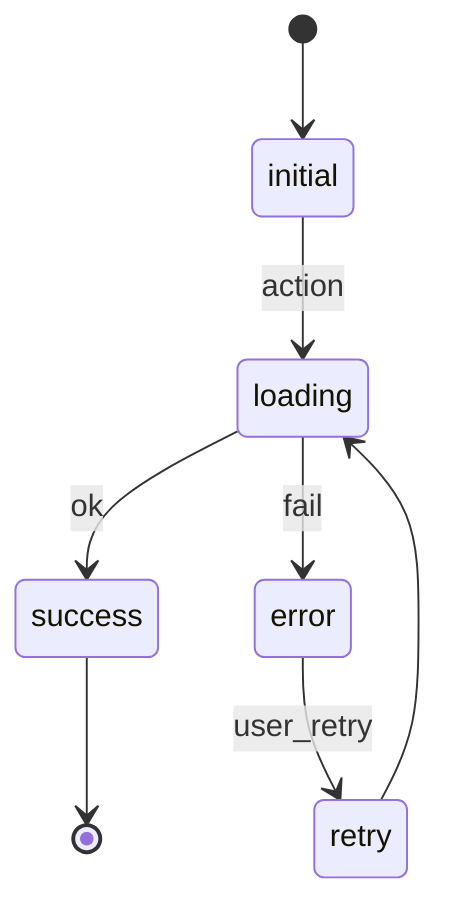
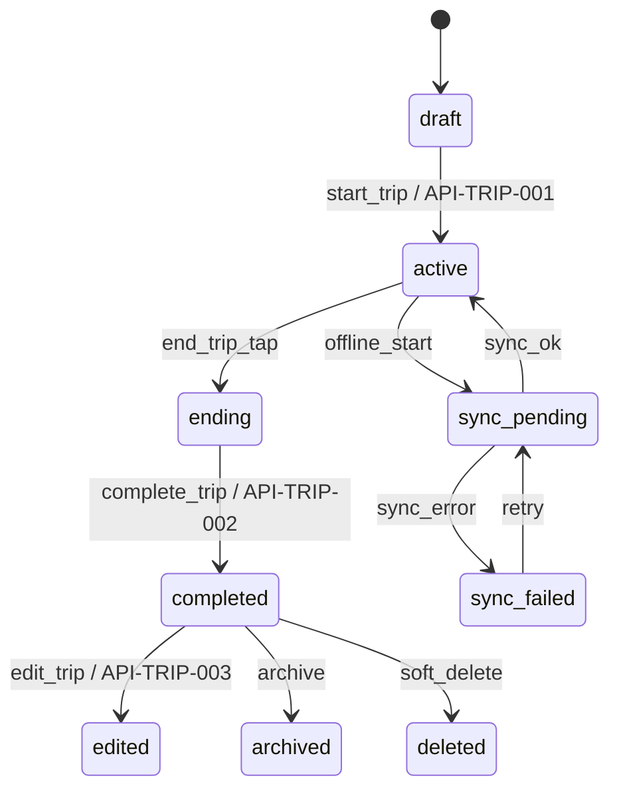

# Mileage & Expense Copilot

# Master Build Blueprint

# Volume 13 — Component State Machines & Workflow Logic

**Version 1.0**

---

## Who This Document Is For

Volume 13 defines every major workflow as an **explicit state machine** so the app behaves predictably — especially during uploads, OCR, payments, offline use, sync failures, report generation, and AI review.

| Role | Use this volume to… |
|------|---------------------|
| **Engineers** | Implement `status` enums — not scattered booleans |
| **Designers** | UI copy and loading states per transition |
| **QA** | Test every path in Ch. 10 matrices |
| **Product** | Analytics events tied to transitions (Ch. 9) |

**Related:** [Volume 11 — SCR screens](11-screen-bible.md) · [Volume 12 — API-IDs](12-api-architecture.md) · [Volume 5 — AI](05-ai-design.md) · [Volume 4 — Data](04-database-architecture.md)

---

## State Machine ID Catalog

Permanent **SM-IDs** for traceability in code, tests, and commits.

| SM-ID | Workflow | Primary entity | DB column / table |
|-------|----------|----------------|-----------------|
| SM-TRIP | Trip lifecycle | `trips` | `trips.status` |
| SM-RCP | Receipt capture & link | `receipts` | `receipts.status` |
| SM-OCR | OCR processing | `ocr_results` | `ocr_results.status` |
| SM-EXP | Expense lifecycle | `expenses` | `expenses.status` |
| SM-RPT | Report generation | `reports` | `reports.status` |
| SM-SUB | Subscription | `subscriptions` | `subscriptions.status` |
| SM-SYNC | Offline sync queue | `sync_queue` (IndexedDB + server) | `sync_queue.status` |
| SM-SCR-DASH | Dashboard screen | UI only | — |
| SM-SCR-START | Start Trip screen | UI only | — |
| SM-SCR-REVIEW | Receipt Review screen | UI only | — |

Tracker: [`docs/state-machines/SM-INDEX.md`](../state-machines/SM-INDEX.md)

---

# 1. Purpose

Every important user action must document:

| Element | Description |
|---------|-------------|
| States | Named, enumerable — never implicit |
| Transitions | What event moves A → B |
| Success paths | Happy path to terminal state |
| Failure paths | Error states + recovery |
| Retry rules | When and how many times |
| Recovery behavior | User and system actions |
| User copy | Message per state |

**Bad:** "Upload receipt and process it."

**Good:**

```
idle → capturing → preview → uploading → uploaded → ocr_queued →
ocr_processing → needs_review → approved → linked → synced
```

No workflow is implemented before its state machine is documented here.

---

# 2. State Machine Philosophy

The app must **never** leave the user wondering:

| Question | Answer must be visible |
|----------|------------------------|
| What happened? | Last transition + toast/banner |
| Did it save? | Explicit saved/synced state |
| Can I leave this screen? | Unsaved changes warning if draft |
| Do I need to try again? | Retry CTA on failed states |

Every workflow **always shows a clear state** — in UI, in DB where persisted, and in logs.

> The user should always know: **what happened · what is happening now · what they can do next.**

---

# 3. Universal State Rules

Every state machine defines:

| Rule | Requirement |
|------|-------------|
| **Initial state** | Entry point on screen/API load |
| **Loading state** | In-flight operation (disable duplicate actions) |
| **Success state** | Terminal or handoff to next machine |
| **Error state** | Recoverable; never silent |
| **Offline state** | Local persistence confirmed |
| **Retry state** | Bounded attempts with backoff |
| **Cancel state** | Safe abort without data loss |
| **Final state** | No further transitions without new user action |
| **Audit/events** | `business_events` + `audit_logs` on financial transitions |
| **User messages** | Copy table per state (Volume 10 components) |

### Transition diagram template



---

# 4. Core State Machines Required for Version 1

## SM-TRIP — Trip State Machine

**SCR:** SCR-019, SCR-016, SCR-020, SCR-018, SCR-021  
**API:** API-TRIP-001 through API-TRIP-005  
**FR:** FR-300, FR-301, FR-302, FR-303, FR-304

### States

| State | DB `trips.status` | Description |
|-------|-------------------|-------------|
| `draft` | `draft` | Manual/duplicate entry not started |
| `ready_to_start` | — (UI only) | Form valid, pre-submit |
| `active` | `active` | Trip in progress |
| `ending` | `active` + UI flag | End wizard in progress |
| `completed` | `completed` | Closed with totals |
| `edited` | `completed` | Post-close edit (audit) |
| `archived` | `archived` | Hidden from default lists |
| `deleted` | `deleted` | Soft-delete |
| `sync_pending` | any + queue | Offline create/update queued |
| `sync_failed` | any + queue | Queue error — user notified |

### Transitions



### Critical rules

| Rule | Enforcement |
|------|-------------|
| **One active trip per user** (V1) | API-TRIP-001 → `TRIP_ALREADY_ACTIVE` |
| One active per vehicle (strict) | V1.1 — optional business rule |
| Mileage immutable snapshot | `mileage_rate` locked at complete |
| End odometer ≥ start | `ODOMETER_INVALID` |

### Events & analytics

| Transition | Event | Analytics |
|------------|-------|-----------|
| → active | `TripStarted` | `trip_started` |
| → completed | `TripCompleted` | `trip_completed` |
| → edited | `TripEdited` | `trip_edited` |
| → sync_failed | `SyncFailed` | `trip_sync_failed` |

---

## SM-RCP — Receipt State Machine

**SCR:** SCR-023, SCR-024, SCR-025  
**API:** API-RCP-001 through API-RCP-007  
**FR:** FR-400, FR-401, FR-402, FR-403

### States

| State | DB `receipts.status` |
|-------|----------------------|
| `idle` | — (UI) |
| `capturing` | — (UI) |
| `preview` | — (UI) |
| `uploading` | `uploading` |
| `uploaded` | `uploaded` |
| `ocr_queued` | `ocr_queued` |
| `ocr_processing` | `ocr_processing` |
| `needs_review` | `needs_review` |
| `approved` | `approved` |
| `linked_to_trip` | `linked` |
| `failed` | `failed` |
| `retry_available` | `failed` + retry_count < 3 |
| `deleted` | `deleted` |

### Transitions

```
idle → capturing → preview → uploading → uploaded → ocr_queued →
ocr_processing → needs_review → approved → linked_to_trip
                                    ↓
                              failed → retry_available → ocr_queued
```

### Critical rules

| Rule | Implementation |
|------|----------------|
| **Image saved before OCR** | Storage upload completes → `uploaded` before API-RCP-002 |
| User confirms before expense | `approved` requires explicit save on SCR-024 |
| Offline | `uploading` → local blob → `sync_pending` sub-state |

### User copy

| State | Message |
|-------|---------|
| uploading | "Uploading receipt…" |
| ocr_processing | "Reading receipt…" |
| needs_review | "Review the details below" |
| failed | "Receipt saved. We couldn't read it automatically. Enter details manually or try again." |
| approved | Toast: "{category} · {merchant} · ${amount} saved" |

---

## SM-OCR — OCR State Machine

**Entity:** `ocr_results`  
**API:** API-RCP-002, API-RCP-003, API-RCP-004  
**FR:** FR-401

### States

| State | DB value |
|-------|----------|
| `not_started` | — |
| `queued` | `queued` |
| `processing` | `processing` |
| `completed` | `completed` |
| `low_confidence` | `completed` + confidence < threshold |
| `failed` | `failed` |
| `retrying` | `processing` + attempt > 1 |
| `manually_reviewed` | user saved on SCR-024 |

### Critical rule

> **AI output is never final until accepted by the user.**

`ocr_results.extracted_*` are **suggestions**; `expenses.*` are **truth** after `approved`.

### Confidence thresholds

| Field | High | Low (flag review) |
|-------|------|-------------------|
| total | ≥ 0.85 | < 0.85 |
| date | ≥ 0.80 | < 0.80 |
| merchant | ≥ 0.75 | < 0.75 |

Low confidence → SM-RCP state `needs_review` with amber borders (Volume 10).

---

## SM-EXP — Expense State Machine

**SCR:** SCR-027, SCR-028  
**API:** API-EXP-001 through API-EXP-004  
**FR:** FR-600, FR-610

### States

| State | Description |
|-------|-------------|
| `draft` | In-progress form |
| `suggested` | AI category/amount proposed |
| `user_reviewed` | User touched fields |
| `approved` | Saved to DB |
| `linked` | `trip_id` set |
| `exported` | Included in report export |
| `edited` | Post-approve change (audit) |
| `deleted` | Soft-delete |

Manual expenses skip `suggested` unless AI assist used.

---

## SM-RPT — Report Generation State Machine

**SCR:** SCR-031, SCR-032  
**API:** API-RPT-001 through API-RPT-005  
**FR:** FR-700

### States

| State | DB `reports.status` |
|-------|---------------------|
| `not_started` | — |
| `configuring` | — (UI) |
| `generating` | `queued` / `processing` |
| `generated` | `complete` |
| `previewing` | — (UI) |
| `downloaded` | metadata flag |
| `emailed` | future |
| `failed` | `failed` |
| `regenerating` | `processing` + new job |

### Flow

```
configuring → generating (API-RPT-001) → poll API-RPT-002 →
generated → previewing → downloaded
                ↓
             failed → regenerating
```

Long-running: poll every 2s; show progress; allow leave screen with notification when ready.

---

## SM-SUB — Subscription State Machine

**SCR:** SCR-044, SCR-045, SCR-058  
**API:** API-SUB-001 through API-SUB-005, API-LIM-001  
**FR:** FR-003

### States

| State | DB / Stripe |
|-------|-------------|
| `free` | plan=free, active |
| `trial` | future |
| `checkout_started` | UI + Stripe session open |
| `checkout_completed` | webhook pending |
| `pro_active` | plan=pro |
| `business_active` | plan=business (V1.1) |
| `payment_failed` | past_due |
| `past_due` | grace period |
| `canceled` | cancel_at_period_end |
| `downgraded` | plan=free, data retained |
| `enterprise_manual` | admin flag |

### Critical rule

> **Plan changes must never delete user data.**

Downgrade → `downgraded` → limits enforced on **new** actions only (API-LIM-001).

### User copy

| State | Message |
|-------|---------|
| payment_failed | "Your account is still active for now. Please update your payment method." |
| checkout_started | LoadingButton "Redirecting to checkout…" |

---

## SM-SYNC — Offline Sync State Machine

**SCR:** All core screens  
**API:** FR-1400, FR-1500 · IndexedDB `sync_queue`  
**FR:** FR-1400, FR-1500

### States

| State | Description |
|-------|-------------|
| `online` | Network available |
| `offline` | No connectivity |
| `local_save` | Written to IndexedDB |
| `pending_sync` | Queue entry created |
| `syncing` | Batch upload in progress |
| `synced` | Server confirmed |
| `conflict` | Server version ≠ local |
| `failed` | Retry exhausted |
| `resolved` | User chose version |

### Critical rule

> **Never silently overwrite conflicting records.**

Conflict → SM-SYNC `conflict` → `SyncConflictPanel` (Volume 10) → user merge or pick.

### Per-entity queue ops

| Op | Idempotency key |
|----|-----------------|
| CREATE trip | client-generated UUID |
| UPDATE trip | entity id + version |
| UPLOAD receipt | receipt client id |

---

# 5. Screen-Level State Machines

## SM-SCR-DASH — Dashboard (SCR-015)

| State | UI |
|-------|-----|
| `loading` | `SkeletonDashboard` |
| `empty` | `EmptyTrips` — no history |
| `ready` | Widgets populated |
| `active_trip_present` | `ActiveTripBanner` + highlight widget |
| `offline` | `OfflineBanner` + stale data timestamp |
| `error` | `NetworkErrorState` + retry |

Transitions: load → (empty | ready | active_trip_present); network → offline/online overlay.

---

## SM-SCR-START — Start Trip (SCR-019)

| State | UI |
|-------|-----|
| `empty_form` | Defaults applied |
| `validating` | Inline checks on blur |
| `ready` | Primary enabled |
| `saving` | `LoadingButton` "Starting…" |
| `active_trip_created` | Navigate SCR-016 + toast |
| `validation_error` | Inline field errors |
| `offline_saved` | "Saved on device — will sync when online" |
| `limit_reached` | → SCR-058 Upgrade Modal |

---

## SM-SCR-REVIEW — Receipt Review (SCR-024)

| State | UI |
|-------|-----|
| `loading_ocr` | `OCRProcessingOverlay` |
| `ocr_complete` | Fields populated |
| `low_confidence` | Amber field borders + helper text |
| `user_editing` | Dirty form state |
| `saving` | "Saving…" |
| `approved` | Toast + navigate back |
| `failed` | `OCRErrorState` + manual entry |

---

# 6. Button & Action States

Every primary action uses Volume 10 `LoadingButton` state model:

| Visual state | Behavior |
|--------------|----------|
| `default` | Enabled, label verb |
| `hover` | Desktop only |
| `focus` | Visible ring |
| `disabled` | Validation fail or loading |
| `loading` | Spinner, no double-submit |
| `success` | Brief label change ≤ 1s optional |
| `error` | Revert to default + inline/toast |

### Examples

| Button | Default | Loading | Success | Error |
|--------|---------|---------|---------|-------|
| Start Trip | "Start Trip" | "Starting…" | "Trip Started" (1s) | "Couldn't Start Trip" |
| Save Receipt | "Save" | "Saving…" | — (toast instead) | "Couldn't Save" |
| Generate Report | "Generate" | "Generating…" | — | "Generation Failed" |
| Complete Trip | "Complete Trip" | "Completing…" | — | "Check odometer values" |

**Rule:** Disable button during `loading`; debounce 300ms against rapid tap.

---

# 7. Error Recovery Rules

Every error state offers a **recovery path** — never a dead end.

| Failure | User message | Recovery actions |
|---------|--------------|------------------|
| OCR failed | "Receipt saved. We couldn't read it automatically." | Enter manually · Retry OCR |
| Upload failed | "Upload didn't finish." | Retry upload · Save locally |
| Sync failed | "Saved on this device. We'll try again when your connection improves." | Retry now · View queue |
| Payment failed | "Your account is still active for now." | Update payment · Contact support |
| Active trip conflict | "You already have a trip in progress." | Go to active trip · Cancel |
| Odometer invalid | "Ending odometer must be higher than starting." | Fix values |
| Report failed | "We couldn't build this report." | Retry · Change filters |
| Session expired | "Your session expired." | Sign in again |

Copy lives in `packages/shared/src/copy/errors.ts` — single source.

---

# 8. Event Triggers

Each transition emits system events (Volume 12 Ch. 25):

| Event | Trigger transition | Tables |
|-------|---------------------|--------|
| `TripStarted` | SM-TRIP → active | `business_events` |
| `TripCompleted` | SM-TRIP → completed | `business_events`, `audit_logs` |
| `TripEdited` | SM-TRIP → edited | `audit_logs` |
| `ReceiptUploaded` | SM-RCP → uploaded | `business_events` |
| `OCRCompleted` | SM-OCR → completed | `business_events` |
| `ReceiptApproved` | SM-RCP → approved | `audit_logs` |
| `ExpenseCreated` | SM-EXP → approved | `business_events` |
| `ReportGenerated` | SM-RPT → generated | `business_events` |
| `SubscriptionChanged` | SM-SUB plan change | `business_events`, webhook |
| `SyncFailed` | SM-SYNC → failed | `business_events`, log |

Events feed: analytics · audit · notifications · future outbound webhooks (Volume 12 Ch. 36).

---

# 9. Analytics Events

Every major transition is trackable (Volume 7 stack):

| Analytics key | SM transition |
|---------------|---------------|
| `receipt_capture_started` | SM-RCP idle → capturing |
| `receipt_upload_failed` | SM-RCP uploading → failed |
| `receipt_upload_success` | SM-RCP → uploaded |
| `ocr_started` | SM-OCR → processing |
| `ocr_review_completed` | SM-RCP → approved |
| `ocr_field_edited` | SM-SCR-REVIEW user_editing |
| `trip_started` | SM-TRIP → active |
| `trip_completed` | SM-TRIP → completed |
| `report_generation_started` | SM-RPT → generating |
| `report_downloaded` | SM-RPT → downloaded |
| `upgrade_started` | SM-SUB → checkout_started |
| `upgrade_completed` | SM-SUB → pro_active |
| `sync_conflict_shown` | SM-SYNC → conflict |
| `offline_save` | SM-SYNC → local_save |

Payload always includes: `scr_id`, `sm_id`, `entity_id`, `timestamp`.

---

# 10. QA Requirements

Every SM-ID requires tests (Volume 9):

| Path | Test |
|------|------|
| Happy path | Full transition chain to terminal state |
| Failed path | Each error state + recovery CTA works |
| Retry path | Bounded retries; idempotency |
| Offline path | local_save → pending_sync → synced |
| Permission denied | Camera, storage, auth |
| User cancellation | No orphan records |
| Duplicate action | Rapid tap → one entity |
| Browser refresh | State recoverable from DB/IndexedDB |
| Mobile interruption | Background/foreground mid-upload |

### Matrix example — SM-RCP

| From | Event | To | Test ID |
|------|-------|-----|---------|
| uploading | network_drop | local_save | QA-SM-RCP-01 |
| ocr_processing | timeout | failed | QA-SM-RCP-02 |
| failed | retry | ocr_queued | QA-SM-RCP-03 |
| needs_review | save | approved | QA-SM-RCP-04 |

PR convention: `SM-IDs: SM-TRIP, SM-RCP`

---

# 11. Developer Rule

**No workflow as scattered booleans.**

| ✗ Avoid | ✓ Use |
|---------|-------|
| `isLoading`, `isDone`, `hasError` | `receipt.status === 'ocr_processing'` |
| `needsReview && !isUploading` | explicit `needs_review` state |
| Multiple flags for sync | `sync_queue.status` enum |

### Implementation

```typescript
// packages/shared/src/state-machines/receipt.ts
export const ReceiptStatus = {
  UPLOADING: 'uploading',
  UPLOADED: 'uploaded',
  OCR_QUEUED: 'ocr_queued',
  OCR_PROCESSING: 'ocr_processing',
  NEEDS_REVIEW: 'needs_review',
  APPROVED: 'approved',
  LINKED: 'linked',
  FAILED: 'failed',
  DELETED: 'deleted',
} as const;

export type ReceiptStatus = typeof ReceiptStatus[keyof typeof ReceiptStatus];

export function canTransition(from: ReceiptStatus, to: ReceiptStatus): boolean {
  // documented transitions only
}
```

State machines live in `packages/shared/src/state-machines/`. UI derives display from status — never duplicate state in React `useState` without syncing to canonical status.

Optional: XState for complex flows (SM-RCP, SM-SYNC) — if used, diagram must match this volume.

---

# 12. Volume 13 Non-Negotiables

| # | Rule |
|---|------|
| 1 | Every major workflow has explicit states |
| 2 | Every state has user-facing copy |
| 3 | Every failure has recovery |
| 4 | Every financial transition is auditable |
| 5 | AI states separate from user-approved states |
| 6 | Offline states never lose data |
| 7 | No workflow ends in ambiguity |
| 8 | No boolean soup — use enums |
| 9 | State transitions documented before code |
| 10 | QA tests cover all paths in Ch. 10 |

---

# Final Standard

The user should always know three things:

1. **What happened.**
2. **What is happening now.**
3. **What they can do next.**

If any screen leaves one unanswered, the state machine specification is **incomplete** — update Volume 13 before shipping.

---

## Cross-Reference Index

| Volume | Link |
|--------|------|
| Volume 4 | DB `status` columns, `business_events` |
| Volume 5 | AI vs user-approved separation |
| Volume 11 | SCR screen state maps (Ch. 5) |
| Volume 12 | API triggers events (Ch. 8, 25) |
| Volume 14 | EVT-IDs, dashboards, privacy (Ch. 15) |

---

## Document Map

| Need | Go to |
|------|-------|
| Screen specs | [Volume 11](11-screen-bible.md) |
| API contracts | [Volume 12](12-api-architecture.md) |
| SM tracker | [SM-INDEX.md](../state-machines/SM-INDEX.md) |
| Offline FR | [Volume 3 FR-1400/1500](03-functional-requirements.md) |

---

*Previous: [Volume 13 — State Machines](13-state-machines.md) | Next: [Volume 14 — Analytics](14-analytics.md)*
