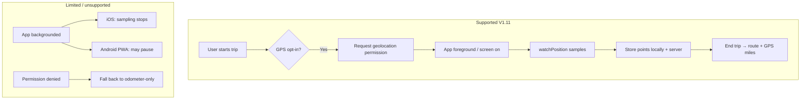

# STEP-070 — GPS trip tracking (MEC-V1-S038) · V1.11

**Target version:** 1.11.0 · **Slice:** MEC-V1-S038 · **Wave:** WAVE-003 ext (Travel / LOC)  
**Status:** Complete · **1.11.0**
**Supersedes deferral:** [DEC-002](../decisions/DEC-002-v1-scope-lock.md) (“GPS auto-tracking → V1.1+”)

---

## 1. Problem statement

Field users want **automatic mileage coverage while a trip is active** — not only manual odometer entry. When the trip ends, they need a **credible record of when and where they traveled** (route + timestamps) for reimbursement and audit, without promising native-app background GPS that the current PWA cannot reliably deliver.

**Today (V1.10):** Trips use manual `startLocation` / `endLocation` text and odometer math only. No `navigator.geolocation`, no `gps_points` table, no route UI.

**Blueprint intent:** FR-300/301/302 + FR-500 already describe GPS coords, haversine mileage, and `gps_points` history — deferred until now.

---

## 2. Goals & non-goals

### Goals (V1.11)

| ID | Goal |
|----|------|
| G1 | Opt-in **“Track mileage with GPS”** when starting (or on active trip) |
| G2 | Sample location **while trip is active and app is in foreground** (installed PWA or mobile browser) |
| G3 | Persist **`trip_gps_points`** with lat/lng, accuracy, timestamp |
| G4 | On **end trip**, show **route summary**: map polyline, elapsed time, GPS distance estimate, point timeline |
| G5 | **FR-500 mileage precedence**: odometer authoritative when both exist; GPS fills gap when odometer missing; flag >10% divergence |
| G6 | **Offline-safe**: buffer points in IndexedDB; sync with existing offline queue (STEP-053) |
| G7 | **Privacy UX**: clear permission copy, per-trip opt-in, Settings default + disable |

### Non-goals (V1.11 — defer to V1.12+ / V2)

| Item | Reason |
|------|--------|
| Background GPS with app closed / phone locked | iOS PWA limits; needs native app (V2) |
| Automatic trip detection (drive started without user action) | FR / AI roadmap V1.2+ |
| Client geofence arrival prompts | V1.2+ per blueprint |
| Mapbox/Google Directions polyline distance | Cost + API; haversine sum on points for V1.11 |
| Continuous 1 Hz GPS polling | Battery; use adaptive interval (see §6) |
| Replacing odometer as legal source of truth | Odometer remains primary when provided |

---

## 3. Platform constraints (critical)



| Platform | Foreground tracking | Background |
|----------|--------------------|------------|
| Android Chrome / installed PWA | Good | Unreliable — do not promise |
| iOS Safari / installed PWA | Good while visible | **Not supported** — document clearly |
| Desktop | Optional (low priority UX) | N/A |

**User-facing copy must say:** “Keep the app open while driving for best GPS tracking.”

---

## 4. Functional requirements mapping

| FR | V1.11 delivery |
|----|----------------|
| **FR-300** Start trip | Add `tracking_enabled`, capture `start_lat`/`start_lng` + accuracy; reverse-geocode optional label → `start_location` |
| **FR-301** Active trip | Live GPS badge, estimated GPS miles (non-authoritative), tracking pause/resume, battery note |
| **FR-302** End trip | Capture end coords; stop tracker; show route preview before confirm |
| **FR-500** Mileage calc | Implement GPS path: sum haversine segments; precedence rules (§7) |
| **FR-1400** Offline | Queue GPS points in IDB; batch upload on sync |
| **LOC domain** | New `trip_gps_points` + client `lib/location/*` |

---

## 5. Data model

### 5.1 New table: `trip_gps_points`

| Column | Type | Notes |
|--------|------|-------|
| `id` | uuid PK | |
| `trip_id` | uuid FK → trips | ON DELETE CASCADE |
| `user_id` | uuid FK | RLS / ownership |
| `latitude` | decimal(9,6) | WGS84 |
| `longitude` | decimal(9,6) | |
| `accuracy_m` | decimal(8,2)? | meters from Geolocation API |
| `altitude_m` | decimal? | optional |
| `speed_mps` | decimal? | optional, if available |
| `heading` | decimal? | optional |
| `recorded_at` | timestamptz | device time, UTC stored |
| `source` | enum | `live` \| `start` \| `end` \| `sync_batch` |
| `created_at` | timestamptz | server receive time |

**Indexes:** `(trip_id, recorded_at)`, `(user_id, recorded_at)`

**Retention:** keep all points for completed trips; purge orphaned batches on trip delete (soft-delete respects `deleted_at` on trip).

### 5.2 Trip table extensions

| Column | Type | Notes |
|--------|------|-------|
| `tracking_enabled` | boolean | default false |
| `tracking_started_at` | timestamptz? | |
| `tracking_stopped_at` | timestamptz? | |
| `start_latitude` | decimal(9,6)? | snapshot at start |
| `start_longitude` | decimal(9,6)? | |
| `end_latitude` | decimal(9,6)? | snapshot at end |
| `end_longitude` | decimal(9,6)? | |
| `gps_miles` | decimal(10,1)? | computed at end from points |
| `mileage_source` | enum? | `odometer` \| `gps` \| `manual` \| `hybrid` |
| `mileage_review_required` | boolean | true when odometer vs GPS diverge >10% |

Existing `start_location` / `end_location` remain **human-readable labels** (geocoded or manual).

### 5.3 User settings (profile or JSON prefs)

| Key | Default | Purpose |
|-----|---------|---------|
| `gpsTrackingDefault` | `off` \| `ask` \| `on` | Pre-check start-trip toggle |
| `gpsHighAccuracy` | false | `enableHighAccuracy` flag |

Store in `UserProfile.notification_prefs` extension or new `app_prefs` jsonb — **prefer minimal migration**: extend existing JSON prefs pattern if one exists, else `user_profiles.app_prefs` jsonb column.

---

## 6. Client architecture

### 6.1 Modules (new)

```
apps/web/src/lib/location/
  geolocation.ts       # permission, getCurrentPosition, watchPosition wrapper
  tracker.ts           # TripGpsTracker class — start/stop/sample/throttle
  haversine.ts         # point-to-point distance (or re-export from shared)
  offline-gps-queue.ts # IDB store for unsynced points
  reverse-geocode.ts   # optional: OpenStreetMap Nominatim or server proxy

apps/web/src/components/trips/
  GpsTrackingToggle.tsx
  ActiveTripGpsBanner.tsx
  TripRouteMap.tsx          # static map or Leaflet-lite / SVG polyline V1.11
  TripGpsTimeline.tsx       # list of samples / stop events

packages/shared/src/calculations/
  gps-mileage.ts       # sumPathMiles(points), compareOdometerVsGps
```

### 6.2 Sampling strategy (battery-conscious)

| State | Interval | Notes |
|-------|----------|-------|
| Moving (speed > 2 m/s or Δposition > 30m) | 15–30 s | Configurable constant |
| Stationary | 60–120 s or pause | Reduce writes |
| App `visibilitychange` → hidden | Pause watch | Show “Tracking paused — return to app” |
| App visible again | Resume | Backfill gap note in timeline |

**Max points per trip:** 2,000 (soft cap; downsample on upload if exceeded).

### 6.3 Permissions flow

1. User enables **Track with GPS** on start form (or toggles on active trip banner).
2. Browser prompt → if **denied**, show inline fallback; trip still starts odometer-only.
3. Settings → Privacy: link to location policy; toggle default behavior.

---

## 7. Mileage precedence (FR-500)

```
1. If start_odometer AND end_odometer valid → miles_odometer = end - start
2. If gps points ≥ 2 → miles_gps = sum(haversine segments)
3. If both present:
     - If |miles_odometer - miles_gps| / miles_odometer > 0.10 → mileage_review_required = true
     - Authoritative miles = miles_odometer (odometer wins)
     - Store gps_miles for display
4. Else if only GPS → miles = miles_gps, mileage_source = gps
5. Else if manual override (existing edit flow) → miles = override
6. Else → block end trip with prompt: enter odometer OR wait for GPS points
```

---

## 8. API design

| Method | Path | Purpose |
|--------|------|---------|
| `POST` | `/api/trips/[id]/gps-points` | Batch insert points (max 100/request) |
| `GET` | `/api/trips/[id]/gps-points` | List points for map/timeline (paginated) |
| `PATCH` | `/api/trips/[id]/tracking` | `{ trackingEnabled: boolean }` start/stop |
| `GET` | `/api/trips/[id]/route-summary` | Aggregates: gps_miles, bounds, duration, review flag |

Extend existing:

- `POST /api/trips/start` — accept `trackingEnabled`, `startLatitude`, `startLongitude`
- `POST /api/trips/[id]/end` — accept end coords; server runs FR-500 merge

**Auth:** same as trip ownership; rate-limit batch uploads (existing rate-limit middleware).

---

## 9. UI / screens

| Screen | Changes |
|--------|---------|
| **SCR-019** Start trip | Toggle “Track mileage with GPS”; “Use current location” for start label |
| **SCR-018** Active trip / banner | GPS active indicator, estimated miles, pause/resume, low-accuracy warning |
| **SCR-020** End trip | Route preview card; odometer vs GPS comparison when both exist |
| **SCR-021** Trip detail | Map + timeline tab/section for completed trips with GPS data |
| **Settings → Privacy** | Location & GPS section (or new **Settings → Location**) |
| **Dashboard** ActiveTripBanner | Small GPS pill when tracking |

### Wireframe intent (active trip)

```
┌─────────────────────────────────────┐
│ ● GPS tracking ON    ~12.4 mi est.  │
│ Keep app open while driving         │
│ [Pause tracking]  [End trip →]      │
└─────────────────────────────────────┘
```

### Wireframe intent (trip detail — after end)

```
Route · Jun 25, 8:12 AM – 10:05 AM
[═══════════ map polyline ═══════════]
GPS distance: 47.2 mi · Odometer: 46.8 mi ✓
Timeline ▾
  8:12 AM  Departed · 123 Main St
  9:01 AM  ··· point · I-95 corridor
  10:05 AM Arrived · Client office
```

**Map provider V1.11:** Static image via OpenStreetMap static API **or** inline SVG polyline on simple lat/lng bounds (no API key) — **decision at build time**; default to SVG + list timeline to avoid new vendor deps.

---

## 10. Offline integration (STEP-053)

| Event | Behavior |
|-------|----------|
| Point sampled offline | Append to IDB `gps_points_queue` keyed by `tripId` |
| Trip start offline | `tracking_enabled` stored in local active trip payload |
| Sync on reconnect | Flush queue → `POST .../gps-points` before or after trip sync |
| End trip offline | Store final point + end coords locally; compute provisional GPS miles client-side for display |

Extend `lib/offline/types.ts` and sync-engine ordering: **GPS batches before trip end sync** when possible.

---

## 11. Security & privacy

- Location data is **PII** — include in account export ([STEP-061](../build-steps/STEP-061-monetization-trust.md) export path).
- RLS: user can only read/write own trip points.
- Privacy policy addendum: GPS stored for reimbursement; retention follows trip lifecycle.
- No selling/sharing location data.
- CSP: if using external tile/static map, add `img-src` / `connect-src` for chosen provider only.
- `Permissions-Policy: geolocation=(self)` already set.

---

## 12. Implementation phases (single STEP, ordered)

| Phase | Deliverable | Est. |
|-------|-------------|------|
| **A** | Migration + shared haversine/GPS mileage + API batch ingest | 1–2 days |
| **B** | Start/end “use location” + coords on trip row | 0.5 day |
| **C** | `TripGpsTracker` + active trip UI + foreground sampling | 1–2 days |
| **D** | End trip merge (FR-500) + review flag | 1 day |
| **E** | Trip detail route map + timeline | 1–2 days |
| **F** | Offline queue + settings + docs/tests | 1–2 days |

**Total estimate:** ~6–10 dev days (one build step).

---

## 13. Verification & test plan

### Unit tests (`packages/shared`)

- [ ] Haversine known coordinate pairs (blueprint QA ref)
- [ ] Path sum multi-segment route
- [ ] FR-500 precedence: odometer only, GPS only, hybrid >10%, hybrid <10%
- [ ] Point batch schema validation

### Integration tests

- [ ] POST gps-points → GET returns ordered list
- [ ] End trip with odometer + GPS → correct `miles`, `gps_miles`, `mileage_review_required`
- [ ] Ownership: 403 on other user's trip points

### E2E (Playwright, mocked geolocation)

- [ ] Start trip with tracking → mock `watchPosition` → end trip → trip detail shows GPS miles
- [ ] Permission denied → trip still completes with odometer

### Manual device matrix

- [ ] Android Chrome installed PWA — foreground drive test
- [ ] iOS Safari Add to Home Screen — foreground drive test
- [ ] Airplane mode mid-trip → points queue → sync on reconnect

---

## 14. Release checklist

- [ ] `APP_RELEASE` → 1.11.0 / STEP-070 / MEC-V1-S038
- [ ] Migration deployed to production (`DIRECT_URL` runbook)
- [ ] `/health` optional: `gpsTrackingReady: true` (schema flag)
- [ ] CHANGELOG + BUILD-LOG + SLICE-INDEX
- [ ] Update [SCR-INDEX](../screen-catalog/SCR-INDEX.md) trip screens
- [ ] Amend DEC-002 appendix: GPS auto-tracking → **shipped V1.11**

---

## 15. Risks & mitigations

| Risk | Mitigation |
|------|------------|
| Users expect MileIQ-style background tracking | Clear UX + marketing alignment (DEC-002 amendment) |
| iOS kills tracking | Foreground banner; pause state; odometer fallback |
| GPS drift / tunnel gaps | accuracy_m filter; drop points with accuracy > 100m optional |
| Large point volumes | Batch upload; server downsample for trips > 500 points |
| Battery drain | Adaptive interval; pause when hidden |
| Legal/tax audit | Odometer wins; GPS is supporting evidence |

---

## 16. Follow-on (post STEP-070)

| STEP | Theme |
|------|-------|
| STEP-071 | Help center (backlog) |
| V1.12 | Geofence client arrival, “stopped moving — end trip?” nudge |
| V2 | Native wrapper (Capacitor/React Native) for background GPS |

---

## 17. Key files (expected touch list)

| Area | Paths |
|------|-------|
| Schema | `prisma/schema.prisma`, new migration |
| Shared | `packages/shared/src/calculations/gps-mileage.ts`, `schemas/trip.ts` |
| API | `apps/web/src/app/api/trips/[id]/gps-points/route.ts`, tracking route |
| Services | `trip.service.ts`, new `gps-tracking.service.ts` |
| Client | `lib/location/*`, `components/trips/Gps*.tsx` |
| Offline | `lib/offline/db.ts`, `sync-engine.ts`, `types.ts` |
| Settings | `settings/privacy` or new location page |
| Docs | this file, slice prompt, CHANGELOG |

---

## 18. Acceptance criteria (sign-off)

- [ ] User can opt in to GPS tracking at trip start
- [ ] At least 2 GPS points recorded during active foreground trip
- [ ] Completed trip shows route summary (map or polyline + timeline)
- [ ] GPS mileage computed and stored; odometer precedence enforced
- [ ] Divergence >10% sets review flag visible on trip detail
- [ ] Works in installed PWA on Android; graceful degradation on iOS/denied permission
- [ ] Offline points sync after reconnect
- [ ] CI green: lint, typecheck, unit, integration, build

---

**Next action:** User approval → implement STEP-070 → target release **1.11.0**.
