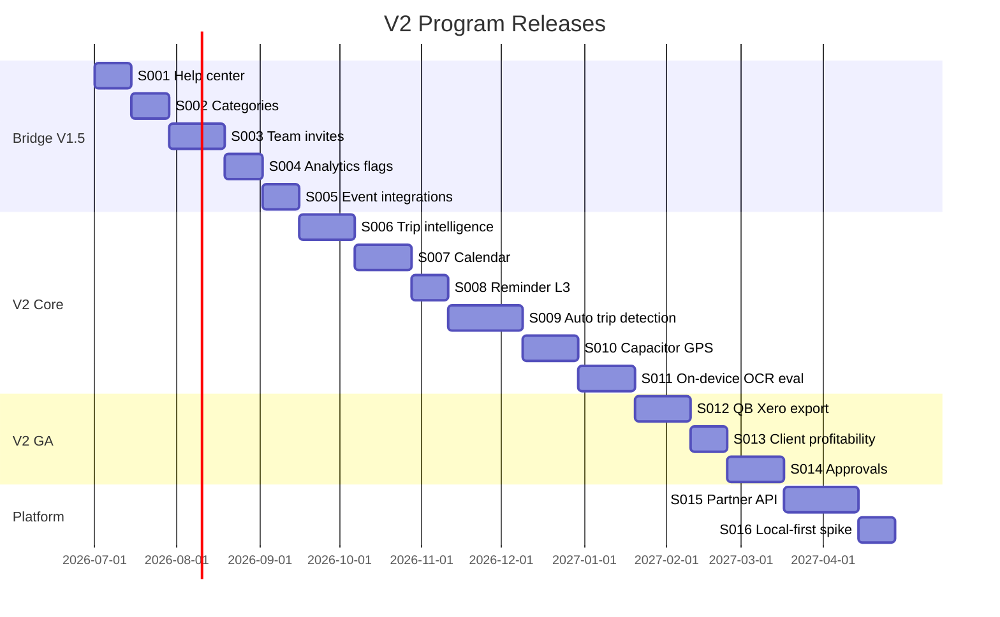
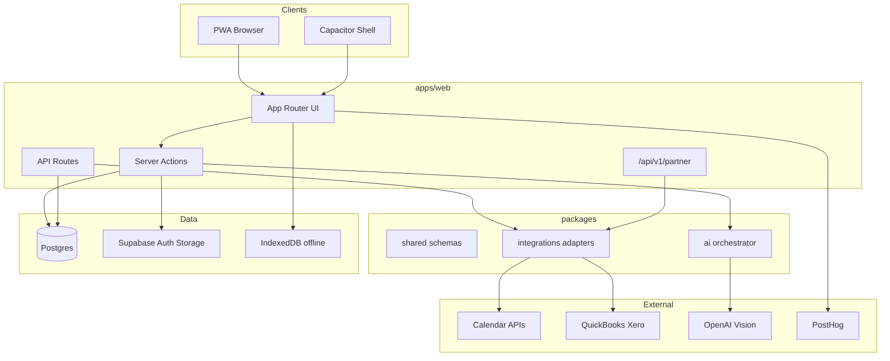

# Version 2 Execution Packet

**Build Packet v2.0** · **STEP-073** · **ROAD-VER-2.0**

> **V1 proved capture + reports + trust.** This packet is the compressed instruction set for **V1.5 bridge → V2.0 Intelligent Field Operations**. Do not start MEC-V2-S001 until [GO-NO-GO-V2-CHECKLIST.md](GO-NO-GO-V2-CHECKLIST.md) core items are ☑.

| Control document | Role |
|------------------|------|
| [MEI](../MASTER-EXECUTION-INDEX.md) | Schedule & BUILD registry |
| [MRMS](../requirements/MRMS.md) | Requirements (MRIDs) |
| [Volume 20](../blueprint/20-product-evolution-roadmap.md) | Strategic roadmap ROAD-* |
| **This packet** | **V2 scope, stack amendments, slices, gates** |
| [DEC-004](../decisions/DEC-004-v2-scope-lock.md) | V2 scope lock |
| [V1 packet](VERSION_1_EXECUTION_PACKAGE.md) | Foundation (complete through V1.13) |

---

## 1. Product Lock

| Field | Value |
|-------|-------|
| **Product name** | Mileage & Expense Copilot |
| **V2 theme** | Intelligent Field Operations |
| **ROAD-ID** | ROAD-VER-2.0 |
| **Core promise (unchanged)** | Every mile. Every receipt. Every report. |
| **V2 goal** | Passive capture drafts, copilot suggestions, team/accountant workflows, integration exports — user confirms all money |
| **Starting release** | V1.13.0 (STEP-072 complete) |
| **Bridge target** | V1.18.0 |
| **V2 GA target** | 2.2.0 |
| **Repo root** | `H:/Travel-Expense/` |
| **Production** | https://travel-mileage.netlify.app |

**V2 is not:** accounting software, tax filing, bank sync, chat-only Copilot, silent financial automation.

**Horizon alignment (Volume 20 Ch. 2):**

| Version | State |
|---------|-------|
| V1 ✅ | Prove capture + reports + trust |
| **V1.5 → V2** | Intelligent automation + teams |
| V3 | Field operations platform (gated) |

---

## 2. Prerequisites

### 2.1 V1 assets to leverage (do not rebuild)

| Asset | Location | V2 use |
|-------|----------|--------|
| `BusinessMember` model | `prisma/schema.prisma` | Team invites (S003) |
| `BusinessEvent` | schema + services | Event bus (S005) |
| `TripGpsPoint` + FR-500 | STEP-070 | Auto detection (S009) |
| Offline queue | `lib/offline/*` | On-device OCR queue (S011) |
| AI engines (partial) | `lib/ai/*` | Orchestrator target (S006+) |
| Field test admin | `/admin/field-test` | Baseline metrics (GO-NO-GO B) |
| PWA shell | STEP-069 | Capacitor wrapper (S010) |

### 2.2 Known V1 gaps (bridge must close)

| Gap | SCR / FR | Slice |
|-----|----------|-------|
| Help center | SCR-051 | MEC-V2-S001 |
| Expense categories UI | SCR-059, FR-610 | MEC-V2-S002 |
| Team access | ROAD-COLLAB | MEC-V2-S003 |
| Product analytics | Volume 14 | MEC-V2-S004 |
| Feature flags | ADM-FLAGS | MEC-V2-S004 |
| ENG-TRIP / ENG-REM / ENG-RPT | ENGINE-INDEX | MEC-V2-S006–S008 |

---

## 3. Tech Stack (V2 amendments)

**Base stack locked:** [DEC-001](../decisions/DEC-001-tech-stack.md)  
**V2 scope locked:** [DEC-004](../decisions/DEC-004-v2-scope-lock.md)

| Layer | V1 | V2 addition |
|-------|-----|-------------|
| App | Next.js 15 PWA | **Capacitor 6** shell (`apps/mobile/` or `apps/web` + capacitor config) |
| Database | Neon Postgres + Prisma | Read replica optional for admin analytics (S004) |
| Auth | Supabase Auth | OAuth providers for calendar (Google, Microsoft) |
| AI | OpenAI Vision | Eval harness; optional **Transformers.js** on-device preview |
| Analytics | Admin CSV | **PostHog** (self-host or cloud) |
| Feature flags | Env only | **`feature_flags` table** or PostHog flags |
| Integrations | — | **`packages/integrations/`** |
| API | Internal routes | **`/api/v1/partner/*`** scoped keys (S015) |
| Mobile GPS | Foreground geolocation | **Capacitor Background Geolocation** (opt-in, S010) |
| Sync | IndexedDB queue | PowerSync **spike** only in S016 |

---

## 4. Release ladder



| Release | APP version | STEP range | Theme |
|---------|-------------|------------|-------|
| Bridge | 1.14.0 – 1.18.0 | STEP-074 – 078 | Beta hardening, SMB prep |
| V2 Alpha | 2.0.0-alpha | STEP-079 – 081 | Copilot + calendar |
| V2 Beta | 2.0.0-beta → 2.1.0 | STEP-082 – 084 | Auto detection + native GPS |
| V2 GA | 2.2.0 | STEP-085 – 087 | Integrations + collaboration |
| V2 Platform | 2.3.0 | STEP-088 – 089 | API + sync research |

---

## 5. Build slices (mandatory order)

Full index: [V2-SLICE-INDEX.md](V2-SLICE-INDEX.md)

### Phase A — Bridge (ROAD-VER-1.5)

| Slice | STEP | Name | Target | ROAD-IDs |
|-------|------|------|--------|----------|
| **MEC-V2-S001** | STEP-074 | Help center | 1.14.0 | ROAD-CAT-UX |
| **MEC-V2-S002** | STEP-075 | Expense categories | 1.15.0 | ROAD-CAT-UX |
| **MEC-V2-S003** | STEP-076 | Team invites & accountant | 1.16.0 | ROAD-CAT-COLLAB |
| **MEC-V2-S004** | STEP-077 | Analytics, flags, feedback | 1.17.0 | ROAD-CAT-REL |
| **MEC-V2-S005** | STEP-078 | Event bus + integrations scaffold | 1.18.0 | ROAD-CAT-PLAT |

**Rule:** No V2.0-alpha slices before S001–S005 complete and GO-NO-GO section C ☑.

### Phase B — V2.0 Intelligent capture

| Slice | STEP | Name | Target | ROAD-IDs |
|-------|------|------|--------|----------|
| **MEC-V2-S006** | STEP-079 | Trip intelligence (ENG-TRIP) | 2.0.0-α | ROAD-AI-L3 |
| **MEC-V2-S007** | STEP-080 | Calendar integration | 2.0.0-α | ROAD-INT-CAL |
| **MEC-V2-S008** | STEP-081 | Reminder intelligence L3 | 2.0.0-β | ROAD-AI-L3 |
| **MEC-V2-S009** | STEP-082 | Auto trip detection | 2.0.0-β | MOB-FF-AUTO-TRIP |
| **MEC-V2-S010** | STEP-083 | Capacitor shell + background GPS | 2.1.0 | ROAD-CAT-PERF |
| **MEC-V2-S011** | STEP-084 | On-device OCR + AI eval pipeline | 2.1.0 | ROAD-AI-L2 |

### Phase C — V2 GA

| Slice | STEP | Name | Target | ROAD-IDs |
|-------|------|------|--------|----------|
| **MEC-V2-S012** | STEP-085 | QuickBooks / Xero export | 2.2.0 | ROAD-INT-QB |
| **MEC-V2-S013** | STEP-086 | Client profitability dashboard | 2.2.0 | ROAD-CAT-AI |
| **MEC-V2-S014** | STEP-087 | Manager approval workflows | 2.2.0 | ROAD-COLLAB |

### Phase D — Platform

| Slice | STEP | Name | Target | ROAD-IDs |
|-------|------|------|--------|----------|
| **MEC-V2-S015** | STEP-088 | Partner API v1 + webhooks | 2.3.0 | ROAD-API |
| **MEC-V2-S016** | STEP-089 | Local-first sync spike | 2.3.0 | ROAD-CAT-PLAT |

Slice prompts: [slices/v2/](slices/v2/)

---

## 6. Architecture evolution

### 6.1 Target architecture (V2.2)



### 6.2 Event-first pattern (S005)

Every domain write emits `BusinessEvent`:

| event_type | Trigger |
|------------|---------|
| `trip.started` | Trip start |
| `trip.ended` | Trip end |
| `trip.gps.batch` | GPS upload |
| `receipt.uploaded` | New receipt |
| `receipt.approved` | OCR approve |
| `expense.created` | Expense row |
| `report.generated` | Report complete |
| `ai.suggestion.created` | Engine output |
| `ai.suggestion.accepted` | User confirm |

Engines subscribe via orchestrator — not direct cross-service calls from UI.

### 6.3 AI orchestrator (S006+)

```
apps/web/src/lib/ai/orchestrator/
├── index.ts           # route(event) → engines[]
├── engines/
│   ├── trip.ts        # ENG-TRIP
│   ├── reminder.ts    # ENG-REM
│   ├── report.ts      # ENG-RPT
│   └── memory.ts      # ENG-MEM (RAG preferences)
├── eval/
│   ├── golden-set/    # receipt fixtures
│   └── run-eval.ts    # CI gate
└── types.ts
```

**Release gate (Volume 5 Ch. 24):** OCR eval regression blocks deploy if accuracy drops >2% vs golden set.

### 6.4 Integrations package (S005)

```
packages/integrations/
├── package.json
├── src/
│   ├── index.ts
│   ├── types.ts
│   ├── calendar/
│   │   ├── google.ts
│   │   └── microsoft.ts
│   └── accounting/
│       ├── quickbooks.ts
│       └── xero.ts
└── README.md
```

Adapters implement: `connect()`, `disconnect()`, `listEvents()`, `exportExpenses()` — no business logic in adapter.

---

## 7. Schema deltas (summary)

Apply via Prisma migrations per slice. **No migration in STEP-073** (planning only).

| Slice | Models / columns |
|-------|------------------|
| S002 | `expense_categories` (user_id, business_id, slug, label, is_system, sort_order) |
| S003 | Use `business_members`; add `invitation_token`, `expires_at` if missing |
| S004 | `feature_flags` (key, enabled, rules jsonb, updated_at) |
| S004 | `user_feedback` (user_id, category, message, context jsonb, screenshot_path?) |
| S007 | `calendar_connections` (user_id, provider, tokens encrypted, sync_cursor) |
| S007 | `calendar_event_links` (trip_id, external_event_id) |
| S009 | `trip_drafts` (user_id, detected_at, start/end coords, confidence, status) |
| S012 | `integration_connections` (user_id, provider, tokens, last_export_at) |
| S014 | `reimbursement_requests` (trip_id, status, approver_id, decided_at) |
| S015 | `api_keys` (user_id, hash, scopes, rate_limit, last_used_at) |
| S015 | `webhook_subscriptions` (url, secret, events[]) |

**V3 hook (schema only, no UI in V2):** optional `organizations` parent of `businesses` — document in ADR when S003 ships.

---

## 8. Feature specifications (by slice)

### MEC-V2-S001 — Help center

- Route: `/help`, `/help/[slug]`
- Content: MDX or JSON articles in `content/help/`
- Launch articles (minimum 8): Getting started, Start/end trip, GPS tracking, Receipt scan, Reports, Billing, Privacy, Field test FAQ
- SCR-051 · link from settings + contextual `?` on trip/receipt flows

### MEC-V2-S002 — Expense categories

- Route: `/settings/categories`
- System defaults (existing 7 slugs) + user custom categories per business
- AI category engine uses custom labels in prompts
- Migration: map existing expenses to slugs unchanged

### MEC-V2-S003 — Team invites

- Owner invites by email → `BusinessMember` pending → accept link
- Roles: `owner`, `employee`, `accountant` (read-only + export)
- RLS: accountant cannot mutate trips/receipts
- Small Business tier gate (5 seats)
- SCR: new `/settings/team`

### MEC-V2-S004 — Analytics, flags, feedback

- PostHog: identify user, track `trip_started`, `receipt_approved`, `report_generated`, `gps_enabled`
- Feature flags: `auto_trip_detection`, `trip_intelligence`, `on_device_ocr`
- Feedback widget: shake or settings → form → admin queue
- Extend `/admin/field-test` with correction rate if available

### MEC-V2-S005 — Event bus + integrations scaffold

- Emit `BusinessEvent` on all domain writes (audit existing gaps)
- Create empty `packages/integrations` with types + noop adapters
- ADR: `docs/architecture/decisions/ADR-001-event-bus.md`

### MEC-V2-S006 — Trip intelligence

- After trip end: suggest missing fuel receipt if miles > threshold
- Suggest unattached receipts from same day
- "Package trip" action → pre-select linked items for report
- Store in `ai_suggestions` with `engine: trip`
- **Never auto-attach** — user taps Accept

### MEC-V2-S007 — Calendar integration

- OAuth connect in `/settings/integrations`
- Read-only calendar events (next 7 days)
- "Create trip from event" draft — user confirms start
- Privacy: store minimal event fields (title, start, location, id)

### MEC-V2-S008 — Reminder intelligence L3

- Push/in-app: active trip > 4 hours, end trip nudge
- End-trip checklist enhanced with ENG-REM rules
- Learn quiet hours from `app_prefs`

### MEC-V2-S009 — Auto trip detection

- Use Activity Recognition API + GPS speed patterns
- Create `trip_drafts` — user sees "Did you drive for work?" notification
- Confirm → normal trip; dismiss → log dismissal for ML
- Feature flag default **off**; beta opt-in
- **Non-goal:** fully silent auto-start (N6 + trust)

### MEC-V2-S010 — Capacitor native shell

- `npx cap init` wrapping `apps/web` export or live reload dev
- iOS + Android build pipelines documented
- Background geolocation plugin — opt-in, battery disclosure
- App Store / Play Store **beta track** only until 2.2 GA

### MEC-V2-S011 — On-device OCR + eval

- Transformers.js or native ML Kit for **preview** text on capture
- Server OCR remains authoritative on approve
- Golden set: 50 receipt fixtures in repo
- CI job: `pnpm ai:eval` must pass

### MEC-V2-S012 — Accounting export

- QuickBooks Online export (CSV/IIF or API if approved)
- Xero manual journal CSV
- One-way export — no sync conflict resolution in V2

### MEC-V2-S013 — Client profitability

- Dashboard widget + `/clients/[id]/profitability`
- Sum: trip miles × rate + expenses by client/project
- Read-only analytics — no billing/invoicing

### MEC-V2-S014 — Approvals

- Employee submits trip report for approval
- Manager (BusinessMember role) approve/reject
- State machine: draft → submitted → approved → exported

### MEC-V2-S015 — Partner API

- API keys in settings (Small Business+)
- Scopes: `trips:read`, `receipts:read`, `reports:read`
- Webhooks: `trip.ended`, `report.generated`
- Rate limit: 100 req/min default

### MEC-V2-S016 — Local-first spike

- Time-boxed spike doc only unless ROI proven
- Compare PowerSync vs current queue on 3 scenarios
- Decision ADR — adopt or defer to V3

---

## 9. Environment variables (V2 additions)

Add to `.env.example` as slices ship:

```txt
# Analytics — S004
NEXT_PUBLIC_POSTHOG_KEY=
NEXT_PUBLIC_POSTHOG_HOST=

# Calendar — S007
GOOGLE_CALENDAR_CLIENT_ID=
GOOGLE_CALENDAR_CLIENT_SECRET=
MICROSOFT_GRAPH_CLIENT_ID=
MICROSOFT_GRAPH_CLIENT_SECRET=

# Integrations encryption — S007/S012
INTEGRATION_TOKEN_ENCRYPTION_KEY=

# Feature flags — S004 (if not DB-only)
FEATURE_FLAGS_DEFAULT=

# Capacitor — S010
CAPACITOR_SERVER_URL=

# Partner API — S015
PARTNER_API_RATE_LIMIT=100
```

---

## 10. Repository structure (additions)

```
H:/Travel-Expense/
├── apps/
│   └── web/                    # unchanged primary app
├── apps/
│   └── mobile/                 # S010 — Capacitor config (optional path)
├── packages/
│   ├── shared/
│   └── integrations/           # S005
├── content/
│   └── help/                   # S001 MDX articles
├── prisma/
│   └── migrations/             # per-slice migrations
└── docs/
    ├── execution/
    │   ├── VERSION_2_EXECUTION_PACKET.md
    │   ├── V2-SLICE-INDEX.md
    │   └── slices/v2/
    ├── roadmap/
    │   └── v2-baseline-metrics.md
    └── architecture/decisions/
```

---

## 11. Non-negotiables (carry forward)

| ID | Rule | V2 enforcement |
|----|------|----------------|
| N1 | First trip within 5 minutes | Onboarding + calendar draft (S007) |
| N2 | Routine trip < 1 minute | Widgets (S010), auto draft confirm (S009) |
| N3 | Capture works offline | Queue + on-device OCR preview (S011) |
| N4 | Reports professional without editing | Trip package (S006) |
| N5 | Complexity must reduce effort | ROAD-ADMIT-001 on every slice |
| N6 | AI never silently changes money | All engines → suggestion → accept |
| N7 | Export and delete always available | Unchanged |
| N8 | One primary action per screen | Design review on new SCR |

---

## 12. Success metrics

Record baselines in `docs/roadmap/v2-baseline-metrics.md` before S006.

| Metric | Baseline (field test) | V2.2 target |
|--------|----------------------|-------------|
| D7 retention | TBD | +15% |
| Time to first trip | TBD | < 3 min |
| Trip completion rate | TBD | +20% |
| GPS opt-in rate | TBD | +25% |
| OCR correction rate | TBD | −25% |
| Receipts linked / trip | TBD | +30% |
| Reports / MAU | TBD | +40% |
| Support tickets / 100 MAU | TBD | −30% |

---

## 13. Validation commands

Unchanged global:

```bash
pnpm lint && pnpm typecheck && pnpm test && pnpm build
```

V2 additions as slices ship:

```bash
pnpm ai:eval                    # S011 — golden set
pnpm test:integration           # OAuth mocks S007
pnpm --filter integrations test # S005+
```

Capacitor (S010):

```bash
pnpm cap sync && pnpm cap open ios
```

---

## 14. Cursor / agent prompt template

```
Active project: Mileage & Expense Copilot
Build Slice: MEC-V2-S0NN — <name>
Execution Packet: docs/execution/VERSION_2_EXECUTION_PACKET.md
Scope Lock: DEC-004
Prior slice: MEC-V2-S0NN-1 complete
```

Template: [CURSOR-SLICE-TEMPLATE-V2.md](CURSOR-SLICE-TEMPLATE-V2.md)

---

## 15. Go / No-Go

**[GO-NO-GO-V2-CHECKLIST.md](GO-NO-GO-V2-CHECKLIST.md)** — core items ☑ before MEC-V2-S001.

---

## 16. Immediate next step

```
STEP-074 → MEC-V2-S001 → Help center (V1.14.0)
```

Copy prompt from [slices/v2/MEC-V2-S001-help-center.md](slices/v2/MEC-V2-S001-help-center.md).

**Do not skip bridge phase** even if eager to build auto trip detection.

---

## 17. Traceability

| Artifact | ID |
|----------|-----|
| Planning STEP | STEP-073 |
| Scope decision | DEC-004 |
| Roadmap | ROAD-VER-2.0, ROAD-VER-1.5 |
| Blueprint | Volume 20 Ch. 6–14 |
| Slice index | [V2-SLICE-INDEX.md](V2-SLICE-INDEX.md) |

PR convention: `ROAD-IDs: ROAD-VER-2.0, ROAD-CAT-AI` · `Step: STEP-0NN` · `MEC-V2-S0NN`
